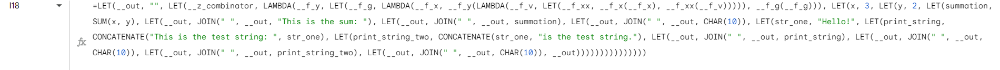
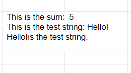

# Py2Excel




For turning `.pysx` to Excel formulas.
If this is  not what you are looking for, Try searching [openpyxl](https://pypi.org/project/openpyxl/).

## How to Use
1. Make a `code.pysx` file.
2. Run the `main.py` script
3. The script will create a `output.txt` file, that text file will contain the excel formula

## Semantics
Only function that is implemented here is `print()`, Here's an example.
```python
a = 5
print(a)
```
This will output 5 to the cell.
These are the valid operators in `pysx`.
- `+` `-` `*` `/` `%` and `**`
- `&` `|` and `^`
- `<<` and `>>`

There are only 3 types in `pysx`: `int`, `float` and `str`

Cells can be referenced directly in the code
```python
summation = A1 + A2
print(summation)
```
Will print the sum of `A1` and `A2`

`if` and `while` are supported, `while` is too complex (`#ERROR!`) for Excel formulas though.
```python
if A1 <= 2:
    print('Too Low :(')
```
is valid.
